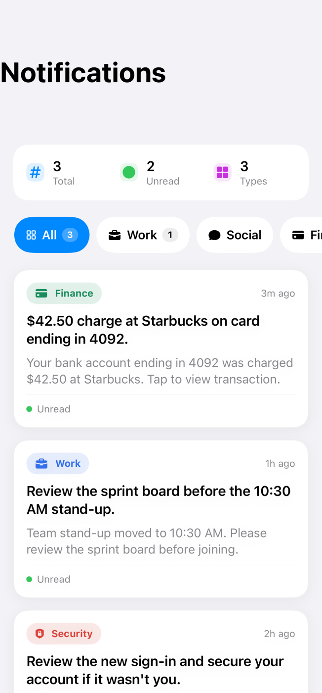
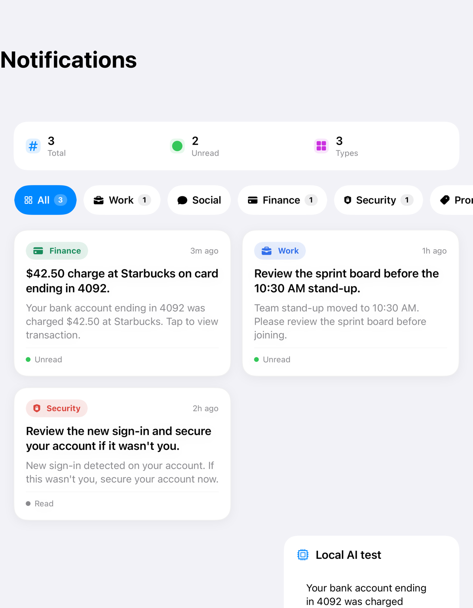
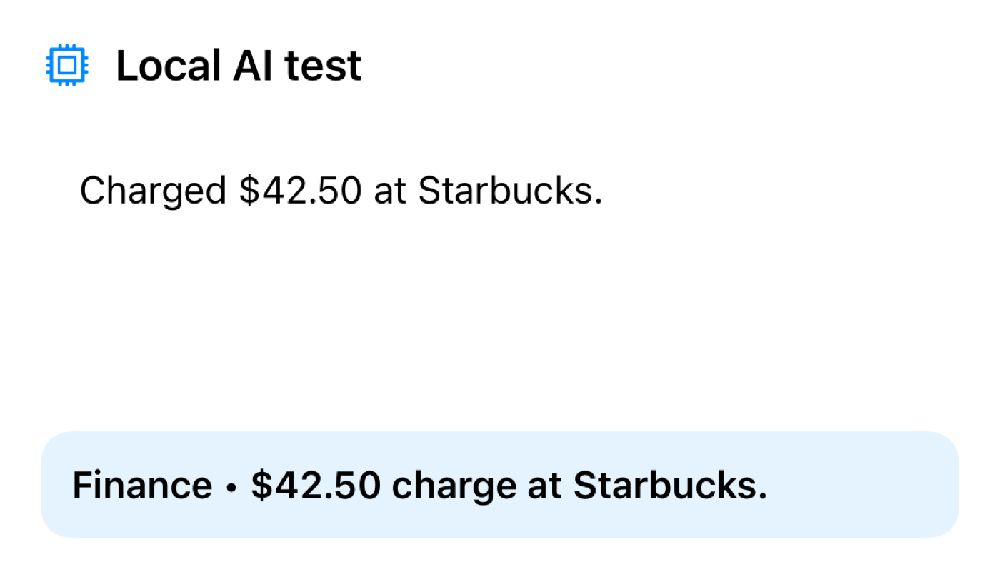
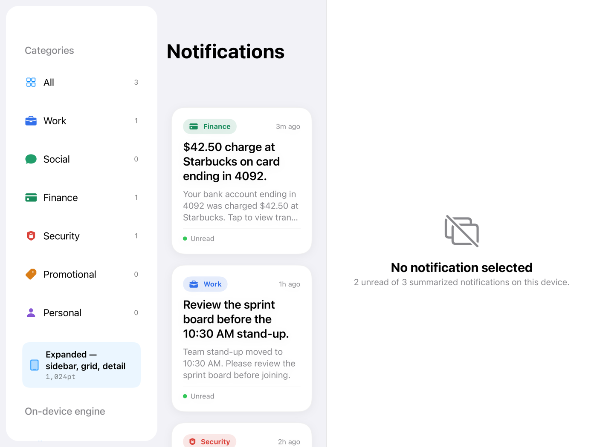
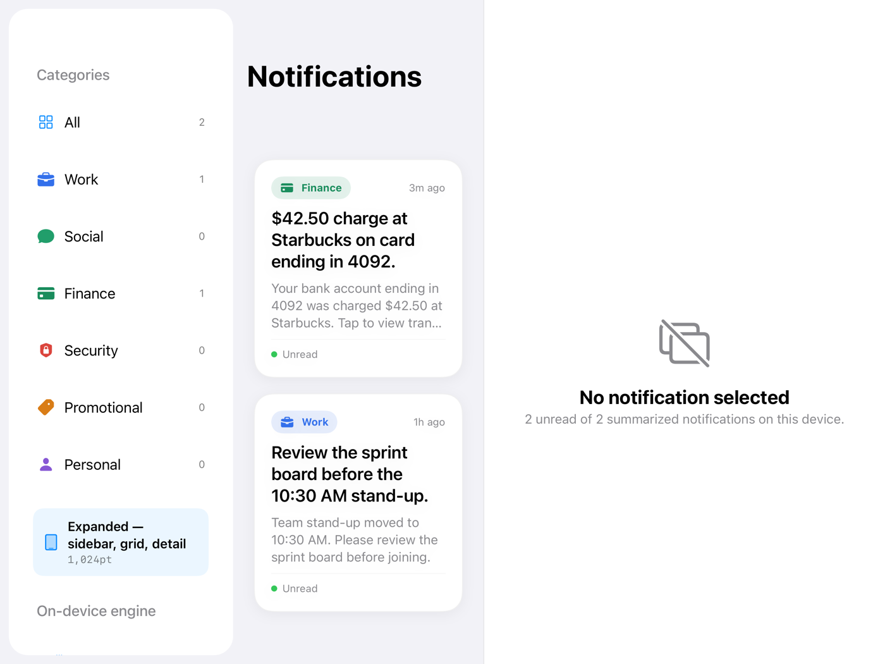
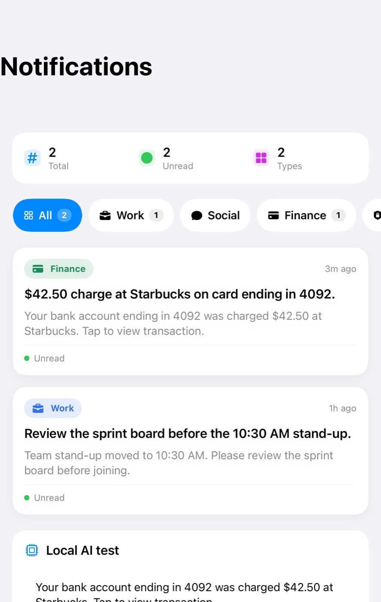

# NotificationSummarizer — iOS 17+

This is a native SwiftUI/SwiftData/App Intents/Core ML project. It is intentionally runnable **without** the Core ML model: until `NotificationClassifier.mlpackage` and its matching `vocab.txt` are added, the app uses the local deterministic fallback classifier/summarizer.

## Screenshots

Every notification is classified into one of six categories, summarized on-device, and shown in an adaptive dashboard that re-flows from a single-column phone list to an iPad sidebar/grid/detail layout.

### iPhone

<table>
  <tr>
    <td width="33%"></td>
    <td width="33%"></td>
    <td width="33%"></td>
  </tr>
  <tr>
    <td align="center">Compact &mdash; single column, scrollable category chips</td>
    <td align="center">Medium &mdash; stats header, category filters, cards</td>
    <td align="center">On-device engine &mdash; summary + category output</td>
  </tr>
</table>

### iPad

<table>
  <tr>
    <td width="50%"></td>
    <td width="50%"></td>
  </tr>
  <tr>
    <td align="center">Expanded &mdash; category sidebar, card grid, detail pane</td>
    <td align="center">Expanded &mdash; dark mode</td>
  </tr>
</table>

<table>
  <tr>
    <td align="center"></td>
  </tr>
  <tr>
    <td align="center">Compact split view &mdash; narrower iPad window with the on-device engine panel</td>
  </tr>
</table>

> Screenshots are generated from the snapshot-test reference renders in
> `NotificationSummarizerTests/__Snapshots__/SnapshotTests/`, so they always match the
> committed UI baseline.

## Open

Open `NotificationSummarizer.xcodeproj` in Xcode 15.4+ (Xcode 16+ recommended), select the `NotificationSummarizer` scheme, choose an iOS 17+ simulator/device, and Run.

## Add the model later

1. Drag `NotificationClassifier.mlpackage` into the `NotificationSummarizer` group.
2. Select **Copy items if needed**.
3. Check **NotificationSummarizer** under Target Membership.
4. Add the exact `vocab.txt` used to train the model under `NotificationSummarizer/Resources/Tokenizer/` and target membership.

The app dynamically loads the compiled Core ML model. No generated model Swift class is required.

## Current behavior

- 100% local processing.
- Six categories: Work, Social, Finance, Security, Promotional, Personal.
- SwiftData persistence.
- App Intent: “Summarize Notifications”.
- 1.5-second classification timeout.
- Rule-based local fallback when the model/tokenizer is unavailable.
- Deterministic 20-word maximum summary fallback.

## watchOS

There is a native watchOS app in the same project (`NotificationSummarizerWatch`, watchOS
10+) running the same on-device engine: a feed with category filters, a capture screen
that dictates or types a notification and summarises it on the wrist, and an overview with
per-category counts.

Select the `NotificationSummarizerWatch` scheme to run it. See [docs/watchos.md](docs/watchos.md)
for the target layout, shared code, installing on hardware, and what is not in there yet.

## Important iOS limitation

A normal third-party app cannot read arbitrary notifications belonging to other apps. To process notifications from your own app, use a Notification Service Extension and an App Group for shared persistence.
