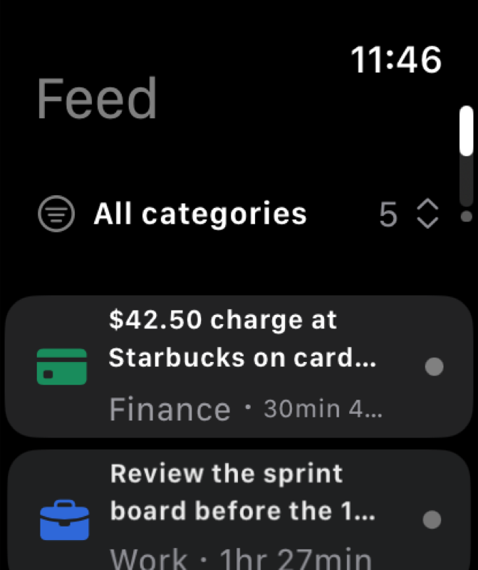
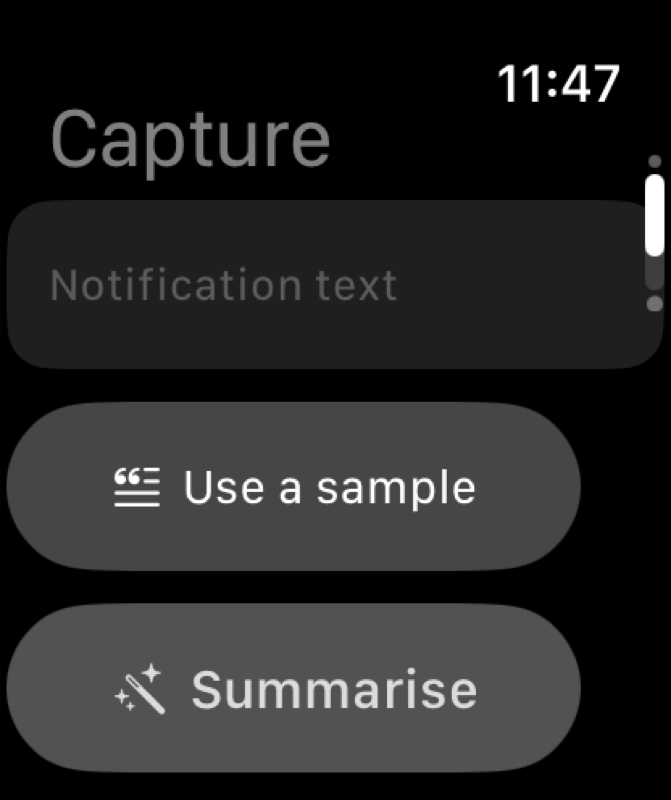
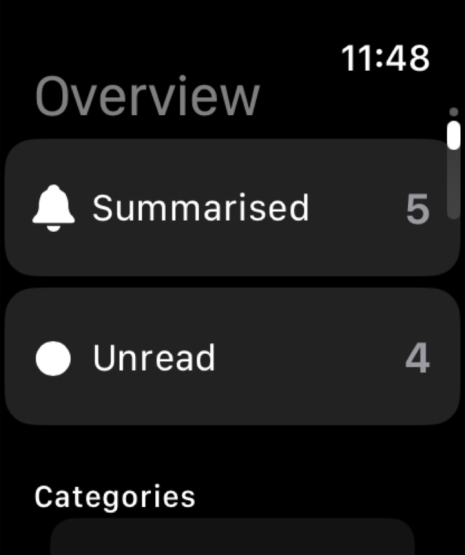

# watchOS app

A native watchOS app that runs the same on-device summariser as the iOS app, built for
the wrist instead of resized from the phone.

| | iOS app | watchOS app |
| --- | --- | --- |
| Deployment target | iOS 17 | watchOS 10 |
| Screens | adaptive dashboard (sidebar / grid / detail), engine panel | feed, capture, overview (vertical pages) |
| Storage | SwiftData `SummarizedNotification` | SwiftData `SummarizedNotification`, separate container |
| Engine | `LocalMLEngineActor` | `LocalMLEngineActor` (same actor, same fallback) |
| Tests | 66 unit + snapshot tests | none yet |

## Requirements

- Xcode 26 (the SDK used to verify this target is watchOS 26.5).
- watchOS 10+ for `TabView`'s vertical page style, `ContentUnavailableView`,
  `LabeledContent` and sensory feedback.
- A paired iPhone running watchOS 10+ is needed to *install* the app on hardware. The
  simulator does not need one.

## Run it

In Xcode: open `NotificationSummarizer.xcodeproj`, pick the **NotificationSummarizerWatch**
scheme and an Apple Watch simulator, then Run.

From the command line:

```sh
xcodebuild build \
  -project NotificationSummarizer.xcodeproj \
  -scheme NotificationSummarizerWatch \
  -destination 'platform=watchOS Simulator,name=Apple Watch Series 11 (46mm)' \
  -derivedDataPath build/DerivedData \
  CODE_SIGNING_ALLOWED=NO
```

You need the watchOS simulator runtime installed once
(Xcode > Settings > Components, or `xcodebuild -downloadPlatform watchOS`).

## What is in the target

```
NotificationSummarizerWatch/
├── Info.plist                      WKApplication marker for a single-target watch app
├── NotificationSummarizerWatchApp.swift   @main App + SwiftData container
├── Support/
│   ├── WatchSummarizer.swift       engine wrapper + persistence
│   ├── WatchNotificationStats.swift unread/total + per-category counts
│   └── WatchSampleData.swift       first-run samples + capture templates
└── Views/
    ├── WatchRootView.swift         vertical-page TabView shell
    ├── WatchFeedView.swift         list, category filter, swipe actions
    ├── WatchNotificationRow.swift  two-line row: category glyph + summary + age
    ├── WatchDetailView.swift       summary, original text, read/delete
    ├── WatchQuickCaptureView.swift dictate/type → classify → summarise → save
    └── WatchOverviewView.swift     totals, breakdown, mark-all-read, delete-all
```

## Screens

**Feed** — every summarised notification, newest first. Swipe up on a row to mark
read/unread, swipe down to delete. The first row is the category filter: tap it to pick
a category in a confirmation dialog (`Menu` does not exist on watchOS, so a dialog is
the one menu-like pattern available).

**Capture** — the capability the phone app cannot offer. Dictate or type a notification
into a multiline field, tap **Summarise**, and the watch classifies and summarises it
on device, showing the category, the summary and how long it took. **Save to feed**
stores it. **Use a sample** offers one-tap texts, because dictating a long sentence on
a watch is slow.

**Overview** — totals, unread count, per-category breakdown, mark-all-read and delete-all.

## No toolbars on any page

The root is a `.verticalPage` `TabView`, and on watchOS a `ToolbarItem` inside a page of
one collapses that page to zero size. The app still launches, the page dots still appear
in the corner, and the screen stays black.

This was found by running the app, not by compiling it — the code builds and installs
cleanly either way. Every action that would naturally sit in a toolbar is therefore a
control in the page content:

| Would-be toolbar item | Where it lives instead |
| --- | --- |
| Feed category filter | First row of the feed list |
| Capture sample templates | "Use a sample" button under the field |
| Detail read/unread + delete | Button row in the detail content |

If a toolbar is ever wanted back on these pages, the root has to stop being a
vertical-page `TabView` first — a plain `NavigationStack` root would allow it.

### Screens

<table>
  <tr>
    <td width="33%"></td>
    <td width="33%"></td>
    <td width="33%"></td>
  </tr>
  <tr>
    <td align="center"><sub>Feed</sub></td>
    <td align="center"><sub>Capture</sub></td>
    <td align="center"><sub>Overview</sub></td>
  </tr>
</table>

Captured on an Apple Watch Series 11 (46mm) simulator, watchOS 26.5.

## Shared code

Four files from the iOS target are compiled into the watch target as well:

| File | Why it is watch-safe |
| --- | --- |
| `Models/NotificationCategory.swift` | `SwiftUI` colour/glyph mapping only. |
| `Models/SummarizedNotification.swift` | `SwiftData` `@Model`, available on watchOS 10. |
| `ML/LocalMLEngineActor.swift` | Core ML, actors and Foundation only — no UIKit. |
| `ML/WordPieceTokenizer.swift` | Foundation only. |

They are added to the watch target's Sources phase by reference, so there is exactly one
copy of the source on disk and one place to change the engine. A local Swift package
would give the same sharing with cleaner boundaries; it was not used here because it
would also mean moving the iOS target onto a package dependency, and this branch is not
meant to touch the phone app's build.

The watch keeps its **own** SwiftData container: each bundle gets its own SQLite file, so
nothing is shared with the phone at runtime yet. The shared `@Model` type is what makes a
future WatchConnectivity sync a mapping exercise rather than a migration.

## The Core ML model

The watch target has an empty Resources phase, so `LocalMLEngineActor` finds neither the
model nor `vocab.txt` and falls back to `RuleClassifier` / `RuleSummarizer`. That is a
deliberate size decision: the committed `weight.bin` is ~36 MB, which is a lot to carry in
a watch bundle for classification accuracy the watch UI barely surfaces.

To ship the model on the watch as well:

1. Drag `NotificationClassifier.mlpackage` into the `NotificationSummarizerWatch` group
   and enable **NotificationSummarizerWatch** target membership.
2. Add the matching `vocab.txt` to the watch target's Resources, in a `Tokenizer`
   folder reference (`LocalMLEngineActor` looks it up with `subdirectory: "Tokenizer"`).
3. Enable the WatchKit capability on the watch target and make sure the watch
   provisioning profile allows running the Core ML model on the device.

## Installing on hardware

The watch target is **not** embedded in the iOS app in this branch. Keeping it out means
the existing iOS scheme, its build and its 66 tests are untouched by watchOS work, and
the watch app builds and runs standalone in the simulator.

To ship on a device, embed it into the iOS app:

1. Select the **NotificationSummarizer** target > **General** > **Watch App** > `+` >
   **NotificationSummarizerWatch**. Xcode adds the target dependency and the
   **Embed Watch Content** copy phase for you.
2. Turn on the WatchKit capability for both targets.
3. Set a real development team and bundle identifiers for both.

If you prefer to edit `project.pbxproj` directly, the two additions are a copy phase on
the iOS target and a target dependency:

```
/* Add to the iOS target's buildPhases, and add the dependency: */
C1 /* Embed Watch Content */ = {
    isa = PBXCopyFilesBuildPhase;
    buildActionMask = 2147483647;
    dstPath = "$(CONTENTS_FOLDER_PATH)/Watch";
    dstSubfolderSpec = 16;
    files = ( /* NotificationSummarizerWatch.app in Embed Watch Content */ );
    name = "Embed Watch Content";
    runOnlyForDeploymentPostprocessing = 0;
};
```

## Not included

Deliberately out of scope for this branch, in rough priority order:

- **WatchConnectivity sync.** The watch store is local. Syncing needs App Groups or a
  watch-to-phone session plus entitlements, which cannot be exercised in CI.
- **Complications.** A WidgetKit extension is a second target and a second pbxproj
  surgery; an unread-count accessory family is the obvious first one.
- **A watch test target.** The phone test bundle is iOS-hosted, so none of these files
  are covered yet. `WatchNotificationStats` and `WatchSampleData` are pure and would be
  the cheapest place to start.
- **CI coverage.** `ios-ci.yml` still runs the iOS scheme only. Adding a watch job means
  downloading the watchOS runtime on every runner; wire it up once this target is
  embedded and device-tested.